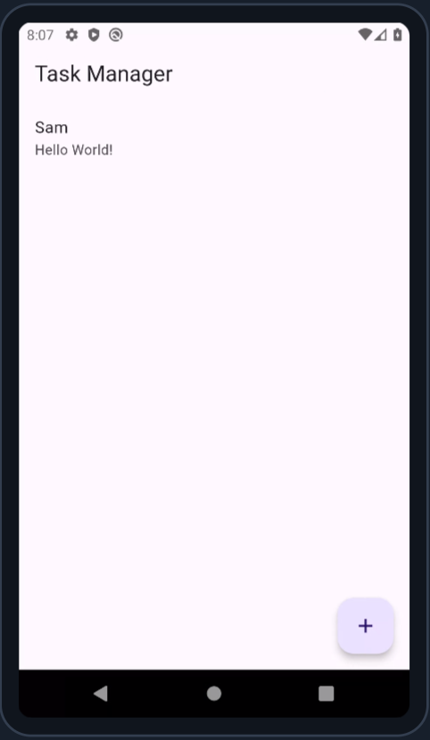
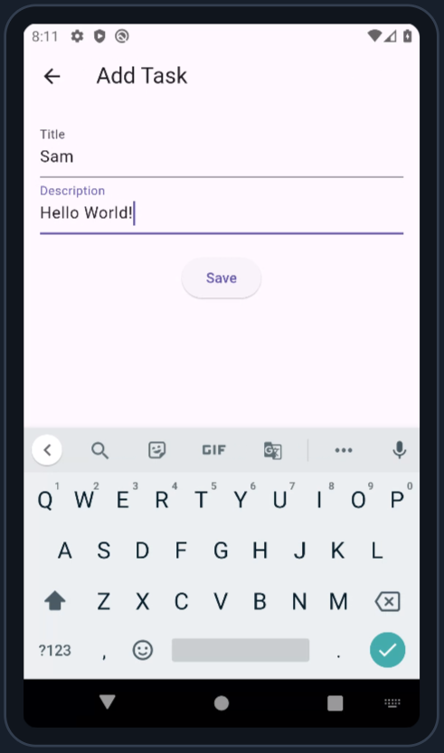
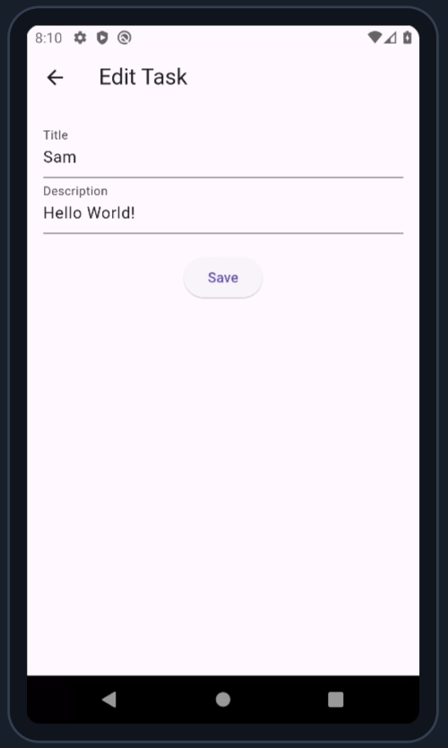

# Task Manager App

## Description
A simple task tracking mobile application built with Flutter. This app allows users to manage their tasks by adding, displaying, editing, and deleting tasks using a local SQLite database.

## Features
- Add new tasks
- Display a list of tasks
- Edit existing tasks
- Delete tasks

## Installation

### Prerequisites
- Flutter SDK
- Android Studio or Visual Studio Code

### Steps
1. Clone the repository:
```sh
   git clone https://github.com/Joy-sameza/task_manager.git
```
2. Navigate to project directory:
```sh
   cd task_manager
```
3. Install dependencies:
```sh
   flutter pub get
```
4. Run the app:
```sh
   flutter run
```
## Screenshot

- 

- 

- 

